## A journalist's basic guide to scrape and analyze a Twitter account with R

Before we start, if it makes you feel better, I’m a low-tech millennial.

As journalists, we seek to publish stories that are newsworthy and have potential. With high demand in daily news output, we turn to social media for breaking news, original stories and trends. And there’s no doubt that social media plays a prominent role in our society today. A survey conducted in 2019 by Ofcom on news consumption among adults and older children in the UK found that 49 percent of over 4,000 participants use social media to consume news. Meanwhile, across the pond, 55 percent of American adults often get their news from social media, according to the 2019 report by Pew Research Center.

Unlike other social media, Twitter allows real-time engagement without exclusivity. You can reply, like or retweet anybody’s tweet at any given time. Twitter is a free platform for advertising and its data can prompt big stories. You can guess a user’s characteristics or personalities by reading their tweets. Many politicians also use Twitter to engage with their constituents. [The New York Times](https://www.nytimes.com/interactive/2019/11/02/us/politics/trump-twitter-presidency.html) did a long read analyzing President Donald Trump’s tweets to find the way he was using Twitter since the 2017 inauguration with interactive graphs. One of the many interest part is that the data shows President Trump tweeted attacks in the early morning or later in the evening, when he is unlikely accompanied by his advisers.

The flood of information on Twitter or other social media could drown or sweep journalists away from original, relevant contents. So it’s necessary to find a tool to filter and analyze the information. This is where R enters the conversation. RStudio is free for use, easy to learn and good for creating data visualization.

This step-by-step guide covers the basics of Twitter scraping and data plotting with RStudio Cloud. Let’s get started:

### Step 1: Getting Twitter API access
Before scraping data from Twitter, we will need access codes. You have to create a new Twitter application which will allow you to connect to the API. You need to have a Twitter account to do this. First, apply for a developer account [here](https://developer.twitter.com/en/apply-for-access.html). Once you’re approved by Twitter you can then create a new application. You will then receive the credentials which are only for you to use.
Here’s a 2-minute video showing [how to create a Twitter application](https://www.youtube.com/watch?v=LpLYQz_3hA0&t=2s)

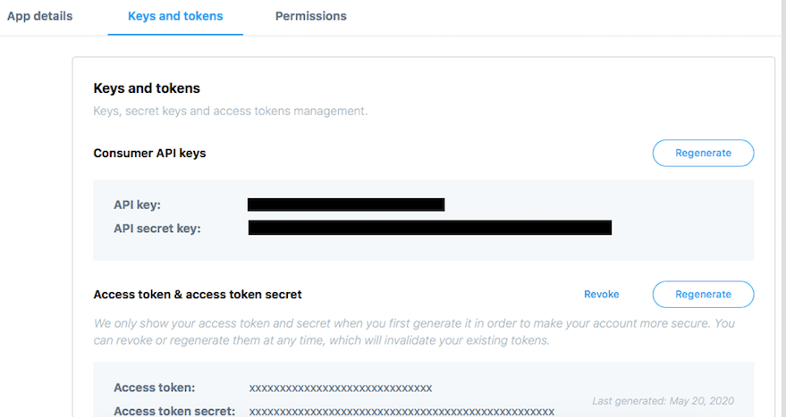

### Step 2: Set up your RStudio Cloud account 
Sign up for [RStudio Cloud](https://rstudio.cloud) account, create a new Project and then create a new R script.
You can also follow this 2-minute video showing [how to quickly setup your account](https://www.youtube.com/watch?v=U-pLWJO6-P4)

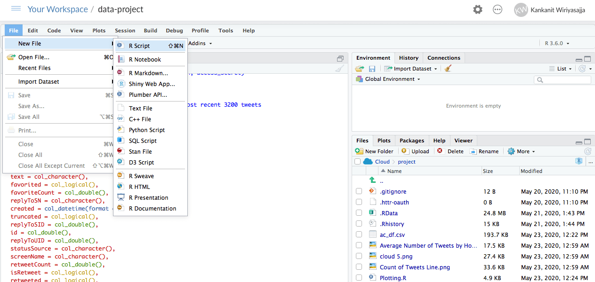

### Step 3: Scraping Tweets
R Script is your playing field. We will use the package ‘twitteR’ to extract the tweets. Note that if you are not working on RStudio Cloud, you will have to ‘install.packages()’ before running ‘library()’.

```markdown
`library (twitteR)`
# Then create Twitter connection
# fill in the info from the app
`api_key <- "xxxxxxxxxsxexcxrxextxxxxxxxxxxxx"
api_secret <- "xxxxxxxxxsxexcxrxextxxxxxxxxxxxx"
access_token <- "xxxxxxxxxsxexcxrxextxxxxxxxxxxxx"
access_secret <- "xxxxxxxxxsxexcxrxextxxxxxxxxxxxx"`
# create twitter connection
setup_twitter_oauth(api_key, api_secret, access_token, access_secret)
```
Now time to choose a Twitter account to analyze. In this example, we will look at [@NYGovCuomo](https://twitter.com/NYGovCuomo), the account of Andrew M. Cuomo, governor of New York.

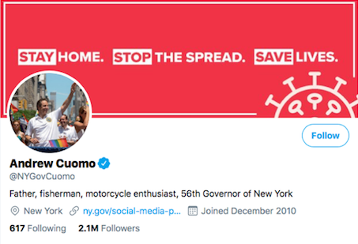

```markdown
# pick a user to analyze
username='NYGovCuomo'
# we will be using the maximum number of 3200 tweets that Twitter allows viewing
cuomo=userTimeline(username,n=3200)
# convert tweets into dataframe
ac_df=twListToDF(cuomo)
# we can save the dataframe for later use 
write.csv(dataframe,"tweets.csv", row.names = FALSE)
```

### Step 4: Plotting
For the first plot, we will look at a timeline with the name of each account Cuomo replies to:

```markdown
# Import the ‘stringr’ package to remove names with old-school retweet text or ‘RT’
library(stringr)
trim <- function (x) sub('@','',x)
# The rt column shows who was retweeted & the rtt shows whether or not it was a retweet
ac_df$rt=sapply(ac_df$text,function(tweet) trim(str_match(tweet,"^RT (@[[:alnum:]_]*)")[2]))
ac_df$rtt=sapply(ac_df$rt,function(rt) if (is.na(rt)) 'T' else 'RT')
```

Once we Run the lines above, we will get a dataset that includes the column called ‘created’ containing specific time each tweet was created in the form of ‘year-mm-dd hh-mm-ss,’ for instance ‘2020-05-05 17:27:40’ and the overall tweets contributors. We will arrange the usernames according to its chronological timeline in the display.

```markdown
# We will need to import the ‘plyr’ package to split the data apart.
library(plyr)
# order the replyToSN in the order that they were tweeted
ac_dfx=ddply(ac_df, 
             .var = "replyToSN", 
             .fun = function(x) 
             {return(subset(x, 
                            created %in% min(created),
                            select=c(replyToSN,created)))
             }
)
ac_dfxa=arrange(ac_dfx,-desc(created))
ac_df$replyToSN=factor(ac_df$replyToSN, levels = ac_dfxa$replyToSN)

# import the ‘ggplot2’ package to plot the result
library(ggplot2)
ggplot(tw.dfs) + geom_point(aes(x=created,y=replyToSN))
```

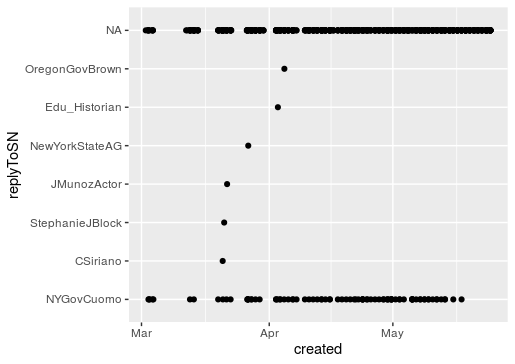

The long line at the top are tweets that contain no replyToSN value, so it appears as NA (Not Available). We can go a little further and plot the display of when Governor Cuomo replied, retweeted and/or neither. We will assign black dots to represent replies, red for retweets and blue to show tweets that are not replies or retweets. 

```markdown
# add color distributions and titles to the plot
ggplot(ac_df)+geom_point(aes(x=created,y=replyToSN), col="blue", size=1)
# add colors
ggplot()+
  geom_point(data=subset(
    ac_df,subset=(!is.na(replyToSN))),
    aes(x=created,y=replyToSN),col="black") + 
  geom_point(data=subset(
    ac_df,subset=(!is.na(replyToSN))),
    aes(x=created,y=rt),col="red")+
  geom_point(data=subset(ac_df,subset=(is.na(replyToSN) & is.na(rt))),
             aes(x=created,y=screenName),col="blue")+
  labs(title = "Cuomo's Reply Tweet Stats",
       subtitle = "Twitter accounts he replies to from April 28 to May 22",
       caption = "Source: data collected from Twitter's REST API via twitteR")
```
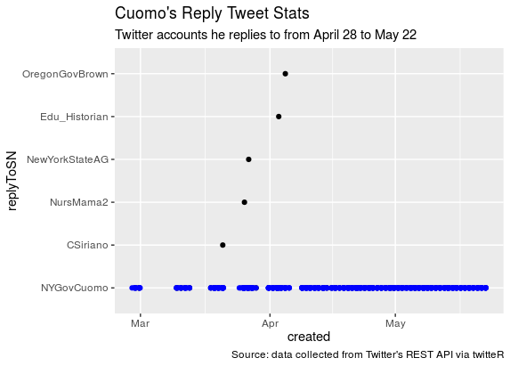

The graph shows Governor Cuomo mostly replying to himself and to only a handful of people. The bold blue-dot line demonstrates that he has repeated interactions with his own tweets. We can double check the number of replies by pulling ‘head()’

```markdown
head(table(ac_df$replyToSN))
NYGovCuomo     CSiriano    NursMama2   NewYorkStateAG   Edu_Historian   OregonGovBrown          
      88             1            1               1                1                1
```

Given each of the users receive the same amount of one reply or a black dot in the previous graph, we don’t need to plot a chart to display who got the most responses. So, we can move on to analyze his Twitter usage timeline.

Now we will plot a jitter or scatter chart and count the number of Governor Cuomo’s tweets by day of the week vs. hour.

```markdown
# label the tweets with the month number
ac_df$month = sapply(ac_df$created, function(x) {p=as.POSIXlt(x);p$mon})
#label the tweets with the hour
ac_df$hour=sapply(ac_df$created, function(x) {p=as.POSIXlt(x);p$hour})
# label the tweets with a number corresponding to the day of the week
ac_df$wday=sapply(ac_df$created, function(x) {p=as.POSIXlt(x);p$wday})

# plotting
ggplot(ac_df,aes(x=wday,y=hour)) + 
  geom_jitter(position=position_jitter(width=.27, height=), col="blue") +
  labs(title = "Cuomo's Tweet Activity by Hour vs. Day in the Week",
       subtitle = "During the period of April 28 to May 22: where 0 is Sunday",
       caption = "Source: data collected from Twitter's REST API via twitteR")
```

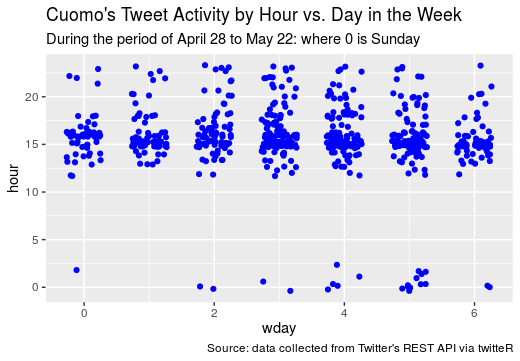

Each dot in this scatter plot represents a tweet. The positions of the dots are only the approximate time each individual tweet was sent in a day of the week. Note that the ‘wday’ function ranks the day of the week starting with Sunday as 0 and so on.

To have a clearer picture, we can use a bar chart to compare what times of day or days of week the New York Governor is tweeting.

```markdown
#plot the number of tweets within particular day of the week
ggplot(ac_df,aes(x=wday))+geom_histogram(aes(y = (..count..)), fill="blue", binwidth=.5)+
  labs(title = "Cuomo's Number of Tweets in A Day of the Week",
       subtitle = "During the period of April 28 to May 22: where 0 is Sunday",
       caption = "Source: data collected from Twitter's REST API via twitteR")
```

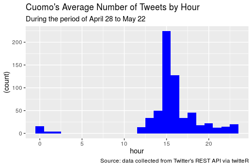

```markdown
#plot the number of tweets within particular hour of the day
ggplot(ac_df,aes(x=hour))+geom_histogram(aes(y = (..count..)), fill="blue", binwidth=1)+
  labs(title = "Cuomo's Average Number of Tweets by Hour",
       subtitle = "During the period of April 28 to May 22",
       caption = "Source: data collected from Twitter's REST API via twitteR")
```

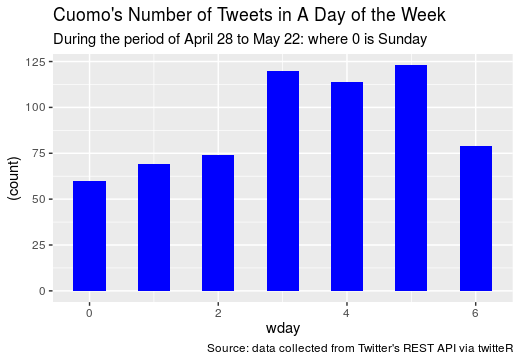

Finally, we can make a time series graph to show Governor Cuomo’s tweeting trend over time. The time series is a line graph with two elements including a timestamp and keep count. We can generate a time series around a user timeline by using a unit value of 1 to link it with each timestamp.

```markdown
# use the xts function to create a timeline
install.packages("xts")
library(xts)
timeseries=xts(rep(1,times=nrow(ac_df)),ac_df$created)

# sum the unit values to get the number of tweets per day
timeseries=apply.daily(ts,sum) 
#also apply. weekly, monthly, quarterly, yearly

#If for any resason we need to turn the timeseries into a dataframe, we can:
timeseries_sum =data.frame(date=index(timeseries), coredata(timeseries))
colnames(timeseries_sum)=c('date','sum')

# plot the timeseries
ggplot(timeseries_sum)+geom_line(aes(x=date,y=sum), col="blue")+
  labs(title = "Cuomo's Count of Tweets",
       subtitle = "During the period of April 28 to May 22",
       caption = "Source: data collected from Twitter's REST API via twitteR")
```

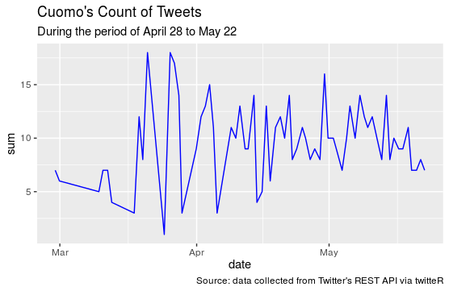

Note that this method pulls the most recent tweets from Twitter, so if you revisit and Run the R Script on a different day, the results may vary. This is why we save the data as a csv at the end of Step3. With the same dataset, we can analyze the sentiment in a bar plot as well as make a word cloud.

```markdown
# read file
library(readr)
text_df <- read.csv("tweets.csv", stringsAsFactors = FALSE)

library(syuzhet)
# convert text into vector
`vector <- as.character(text_df$text)`
# obtain sentiment scores
# 1st observe the score attribution
`get_nrc_sentiment("happy")`
`get_nrc_sentiment("bad")`
# now store the dataset in a
`a <- get_nrc_sentiment(vector)`
# combine the text column with sentiment columns
`sentiment <- cbind(text_df$text, a)`

`library(RColorBrewer)`
# plot
`barplot(sort(colSums(a), decreasing = TRUE),
        las = 1,
        cex.axis = 1,
        col = c("blue"),
        ylab = "Count", xlab = "Sentiment",
        ylim = c(0,600),
        font.axis=1,
        main = "Sentiment Scores for Cuomo's Tweets", 
        sub = "Source: data collected from Twitter's REST API via twitteR",
        cex.sub = .7)`
```

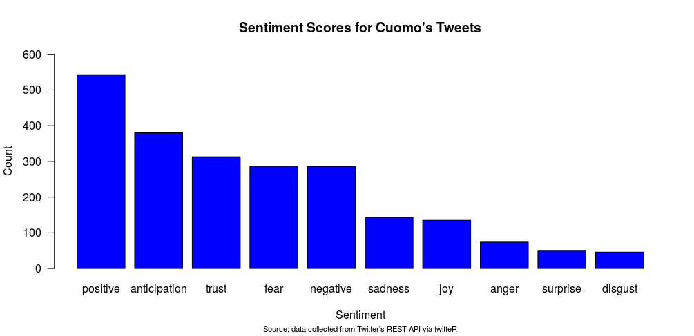

In this bar graph, we look at the overall distribution of sentiment among words tweeted by Governor Cuomo. We can see that the positive sentiment score receives the highest distribution.

```markdown
#Read file
library(readr)
tweets <- read_csv("tweets.csv")
View(tweets)

# build corpus
library(tm)
corpus <- iconv(tweets$text, to = "utf-8")
str(tweets)

# store corpus
corpus <- Corpus(VectorSource(corpus))

###clean the data###
inspect(corpus [1:10])
space <- content_transformer(function (x , pattern ) gsub(pattern, "", x))
corpus <- tm_map(corpus, space, "/")
corpus <- tm_map(corpus, space, "@")
corpus <- tm_map(corpus, space, "\\|")
corpus <- tm_map(corpus, space, "\n")

# remove URl
removeURL <- function(x) gsub("http[[:alnum:][:punct:]]*", "", x) 
removeURL_2 <- function(x) gsub("http[^[:space:]]*", "", x)
corpus <- tm_map(corpus, content_transformer(removeURL))
corpus <- tm_map(corpus, content_transformer(removeURL_2))

# change all text to lower case
corpus <- tm_map(corpus, tolower)

library(textclean)
# remove curly quotes ” and ’
corpus <- tm_map(corpus, replace_curly_quote)
# replace "it's" to "it is"
corpus <- tm_map(corpus, replace_contraction)
# remove numbers
corpus <- tm_map(corpus, removeNumbers)
# remove punctuations
corpus <- tm_map(corpus, removePunctuation)
# remove some words that doesn't add value
corpus <- tm_map(corpus, removeWords, stopwords("english"))
# remove additional words
myStopwords <- c("new","watch", "live","will","get","got", "just", "this", "the", "also", "will", "can", "may", "must")
corpus <- tm_map(corpus, removeWords, c(myStopwords, "s…"))
# match words
corpus <- tm_map(corpus, gsub, pattern = "york", replacement = "newyork")
corpus <- tm_map(corpus, gsub, pattern = "life", replacement = "lives")
corpus <- tm_map(corpus, gsub, pattern = "covid", replacement = "coronavirus")
corpus <- tm_map(corpus, gsub, pattern = "newnew", replacement = "new")
# remove blank spaces
corpus <- tm_map(corpus, stripWhitespace)
inspect(corpus[1:10])

# convert tweets into structure data via term document matrix
tdm <-TermDocumentMatrix(corpus)
# see it in matrix
a <- as.matrix(tdm)
b <- sort(rowSums(a), decreasing = TRUE)
c <- data.frame(word = names(b), freq=b)
# look at the dataset
head(c, 10)

# word cloud
library(wordcloud)
wordcloud(words = c$word, 
          freq = c$freq, 
          scale=c(3,0.5), 
          min.freq=5, 
          max.words=90,
          random.order=FALSE,
          rot.per=0.3, colors = "blue")

```

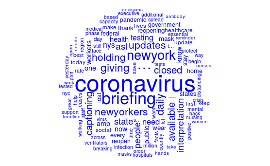

In this visualization, I set the words maximum at 90 plus each word must have been used over 5 times. The size of the word equals how frequent it was mentioned.


```markdown
Syntax highlighted code block

# Header 1
## Header 2
### Header 3

- Bulleted
- List

1. Numbered
2. List

**Bold** and _Italic_ and `Code` text

[Link](url) and 
```

For more details see [GitHub Flavored Markdown](https://guides.github.com/features/mastering-markdown/).

### Jekyll Themes

Your Pages site will use the layout and styles from the Jekyll theme you have selected in your [repository settings](https://github.com/aczx321/data-project/settings). The name of this theme is saved in the Jekyll `_config.yml` configuration file.

